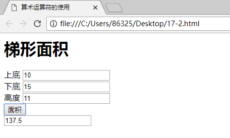

### 1 ECMAScript（ES）  
#### 1.1 JS基本数据类型  
JS提供了四种数据类型：**数值、字符、布尔和空值**。四种数据类型的数据可以是常量，也可以是变量。  
在使用变量之前先进行声明预定义。声明变量使用关键字var。例如：  
```JavaScript
var a;
```
* 算术运算
```JavaScript
<html>
    <head>
        <title>
            算术运算符的使用
        </title>
    </head>
    <body>
        <script language = "javascript">
            function rec(form){
                form.recanswers.value = (form.recshortth.value*form.recheightth.value
                +form.reclength.value*form.recheightth.value)/2
            }
        </script>
        <form>
            <h1>梯形面积</h1>
            上底
            <input type="text" name = "recshortth"><br>
            下底
            <input type="text" name = "reclength"><br>
            高度
            <input type="text" name = "recheightth"><br>
            <input name="button" type="button" onclick="rec(this.form)" value = "面积">
            <br>
            <input type="text" name="recanswers"><br>
        </form>
    </body>
</html>
```
运行效果如下：  
  

