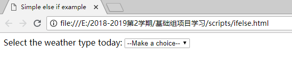

#### 1.3 条件语句   

JS中的条件语句最常见的就是**if...else**。  
##### 1.3.1 if...else基本语法   
请看下面的*伪代码*：  
```JavaScript
if (condition) {
  code to run if condition is true
} else {
  run some other code instead
}
```
代码含义：  
它说“**如果（if）条件（condition）**返回true，运行代码A，否则（else）运行代码B”  
需要注意以下几点：  
1. 关键字 if，并且后面跟随括号。  
2. 要测试的条件，放到括号里（通常是“这个值大于另一个值吗”或者“这个值存在吗”）。这个条件会利用比较运算符（我们会在最后的模块中讨论）进行比较，并且返回true或者false。  
3. 一组花括号，在里面我们有一些代码——可以是任何我们喜欢的代码，并且只会在条件语句返回true的时候运行。  
4. 关键字else。   
5. 另一组花括号，在里面我们有一些代码——可以是任何我们喜欢的代码，并且当条件语句返回值不是true的话，它才会运行。  
**注意：**你不一定需要else和第二个花括号——下面的代码也是符合语法规则的：  
```JavaScript
if (condition) {
  code to run if condition is true
}

run some other code
```
不过，这里你需要注意——在这种情况下，第二段代码不被条件语句控制，所以它总会运行，不管条件返回的是true还是false。这不一定是一件坏事，但这可能不是你想要的——你经常只想要运行一段代码或者另一段，而不是两个都运行。  
最后，有时候你可能会看到 if…else 语句没有写花括号，像下面的速记风格  
```JavaScript
if (condition) code to run if condition is true
else run some other code instead
```
这是完全有效的代码，但不建议这样使用——因为如果有花括号进行代码切割的话，整体代码被切割为多行代码，更易读和易用。  
##### 1.3.2 例子  
为了更好的理解这种语法，让我们考虑一个真实的例子。想像一个孩子被他的父母要求帮助他们做家务。父母可能会说“嗨，宝贝儿，如果你帮我去购物，我会给你额外的零花钱，这样你就能买得起你想要的玩具了。”在JavaScript中，我们可以这样表示：  
```JavaScript
<!DOCTYPE html>
<html>
  <head>
    <meta charset="utf-8">
    <title>Simple else if example</title>
  </head>
  <body>
    <label for="weather">Select the weather type today: </label>
    <select id="weather">
      <option value="">--Make a choice--</option>
      <option value="sunny">Sunny</option>
      <option value="rainy">Rainy</option>
      <option value="snowing">Snowing</option>
      <option value="overcast">Overcast</option>
    </select>

    <p></p>

    <script>
      var select = document.querySelector('select');
      var para = document.querySelector('p');
      var temperature = 29;
      select.onchange = setWeather;
      function setWeather() {
        var choice = select.value;
        if(choice === 'sunny') {
          para.textContent = 'It is nice and sunny outside today. Wear shorts! Go to the beach, or the park, and get an ice cream.';
        } else if(choice === 'rainy') {
          para.textContent = 'Rain is falling outside; take a rain coat and a brolly, and don\'t stay out for too long.';
        } else if(choice === 'snowing') {
          para.textContent = 'The snow is coming down — it is freezing! Best to stay in with a cup of hot chocolate, or go build a snowman.';
        } else if(choice === 'overcast') {
          para.textContent = 'It isn\'t raining, but the sky is grey and gloomy; it could turn any minute, so take a rain coat just in case.';
        } else {
          para.textContent = '';
        }
      }
    </script>
  </body>
</html>
```
* 这里我们有 HTML <select> 元素让我们选择不同的天气，以及一个简单的段落。               
*  在 JavaScript 中, 我们同时存储了对 <select> 和 <p> 的引用, 并对 <select> 添加了一个事件监听器，因此，当它的值改变时，setWeather()函数被执行。       
*  当函数运行时，我们首先新建了一个 choice 变量去存储当前被选的 <select> 中的值。接着我们用条件判断语句根据 choice 的值选择性的展示段落中的文本。注意 else if() {...}段中的条件是怎么被判断的，除了第一个，它是在 if() {...}中被判断的。    
*   最后一个 else {...} 中的选择通常被叫做 “最后招数”  — 在所有的条件都不为 true 时其中的代码会被执行。在这个例子中，如果用户没有选择任何一个选项，它会将段落中的文本清空，例如当用户决定重新选择最开始出现的"--Make a choice--"选项时，就会有这样的效果。    
运行效果如下：          
       
       
        


