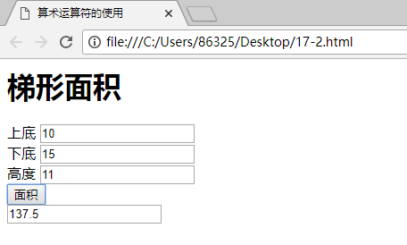

#### 2 匿名函数   

你可能会以不同方式看到定义和调用函数。到目前为止，比如我们创建了如下函数：    
```JavaScript
fun
```
* 算术运算
```JavaScript
<html>
    <head>
        <title>
            算术运算符的使用
        </title>
    </head>
    <body>
        <script language = "javascript">
            function rec(form){
                form.recanswers.value = (form.recshortth.value*form.recheightth.value
                +form.reclength.value*form.recheightth.value)/2
            }
        </script>
        <form>
            <h1>梯形面积</h1>
            上底
            <input type="text" name = "recshortth"><br>
            下底
            <input type="text" name = "reclength"><br>
            高度
            <input type="text" name = "recheightth"><br>
            <input name="button" type="button" onclick="rec(this.form)" value = "面积">
            <br>
            <input type="text" name="recanswers"><br>
        </form>
    </body>
</html>
```
运行效果如下：  
  

